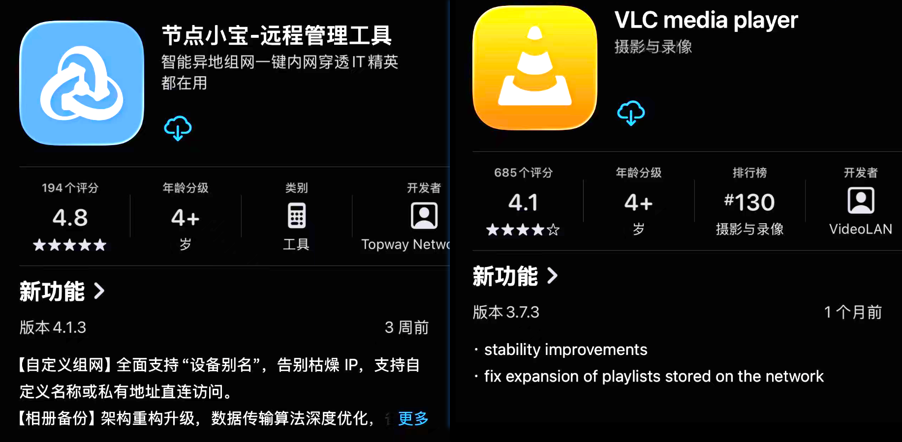
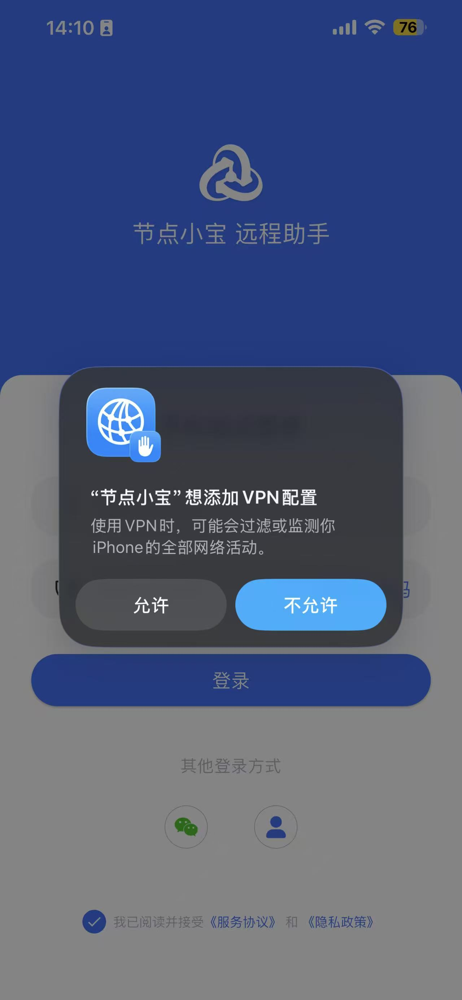
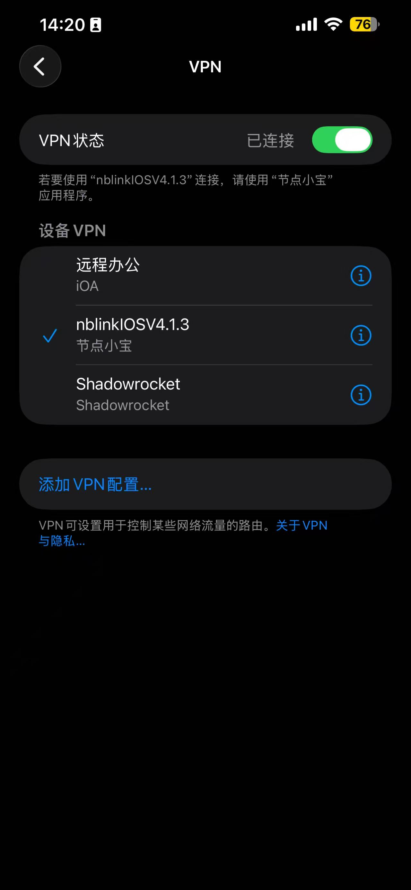
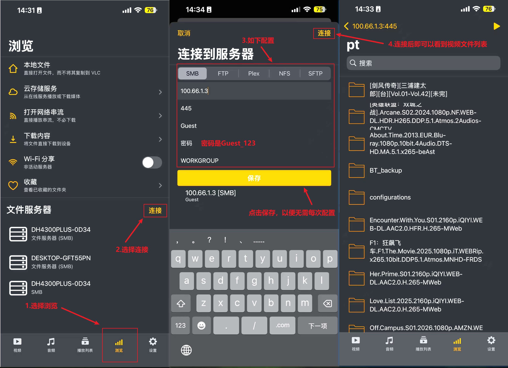
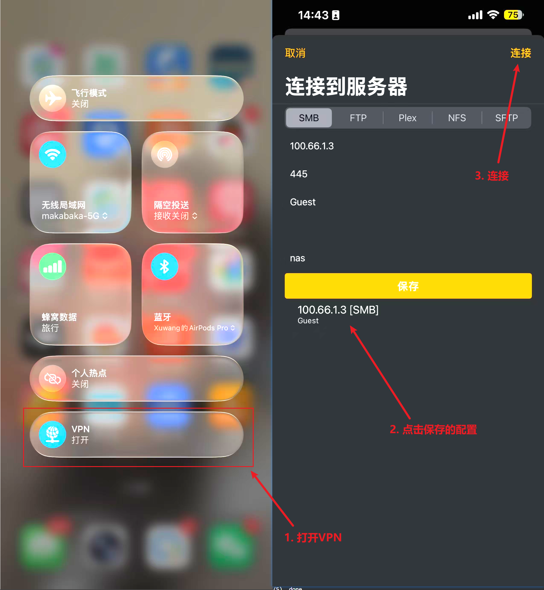

本文描述如何在非局域网环境下访问NAS上的视频资源，通过SMB方式在终端设备上播放。

# 一、终端设备下载两个APP
分别下载【节点小宝-远程管理工具】以及【VLC media player】，前者用于组网，即可以在非同局域网环境下将内网IP映射为某一个局域网IP（通过云服务搭桥，让不同内网间的设备可以直连，云服务仅参与握手），后者用于从指定IP中通过SMB服务播放视频内容。  

# 二、初次使用时配置网络环境以及视频源
打开节点小宝app，允许配置VPN  
  
然后输入手机号15901008525，通过该账号将NAS设备和你的终端设备映射到同一个局域网下面（找手机号主人要验证码）。  
登录后即组网成功，可以在手机系统的VPN页面选择打开或者关闭VPN：  
  

# 三、配置VLC播放器的视频源
在开启VPN的情况下，通过如下方式配置VLC播放源：  
  

# 四、日常使用
  